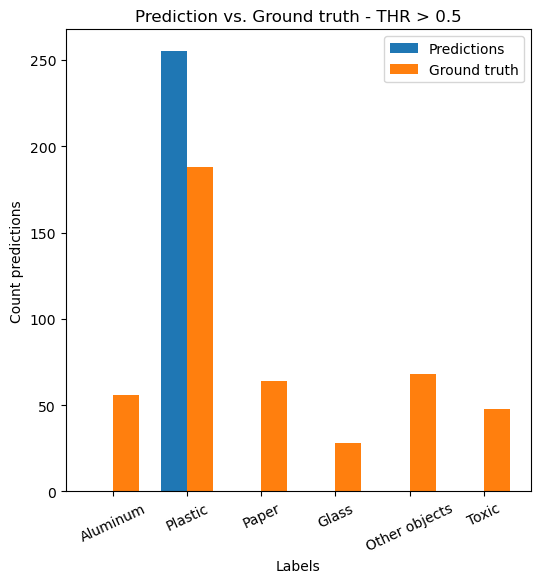

# TACO_MJS
This multi-label classification model is based on the TACO dataset (http://tacodataset.org/). The aim is to detect different kind of trash, this can be used for automatic trash separation. I want to see the impact of image augmentation on model performance. 

This is inspired by the amazing project with Neatleaf, where we could unfortunately not showcase our code on gitHub, as we were working on their code base and with their images. As a result I am thrilled to apply the gained knowledge on a new dataset, a topic that is also close to my heart, preserving and protecting nature.

## :construction: WORK IN PROCESS :construction:

# Workflow

1. Sight the data and the data structure

Instead of the data beeing dispersed in 15 different folders (not sorted by classes - random) and the annotations beeing in a json file, I prefer to have the images all in one folder and the corresponding annotations in a csv file to more easily select labels or split the dataset.

2. Feature engineering & balancing

There are 28 super-categories and 60 categories labelling every kind of trash, e.g. glass bottle, plastic bottle or six pack rings. In my opinion the ultimate goal is to separate trash by material. For this and computational reason I introduced the following 6 categories: plastic, aluminium, paper, glass, other_objects (e.g. shoes) and toxic (batteries).

The multitude of objects and shapes makes it difficult for the model to operate. Merging the labels further also improves the accuracy.

Some categories appear often like glass bottles (150+) and others are rare. Tackling the problem I partially balanced the data by oversampling (duplicating) rare categories. The file 'train_material_partially_balanced_2023-04-13.csv' is now partially balanced and the rare cases are duplicated so all features have roughly the same (70%) proportion. This increased the row count from 1053 to 4234 rows.

3. Set up base model

The base model ran and was tracked with mlflow. Because of computing constrains (no GPU) on my laptop I moved the computations to Google Colab to access GPU. 

4. Apply image augmentation

Albumentation library is implemented, now the augmentations and parameter-limits need to be determined. Previous experiments with Neatleaf revealed little to moderate augmentations help model performance. The main effect is an increased area which the model uses determine the label of the object. 

5. Hyperparameter tuning (e.g. exponential learning rate)

Different approaches are to be considered:

- Dynamic learning rate
- Freezing the first n layers
- Epochs and batch size
- Model architecture (VGG, ResNet, Inception)
- Amount of augmentation
- Feature engineering

## First results

As you can see, when the threshold for a prediction is > 0.5 Plastic is the only category that is predicted. Lowering the threshold to 0.22, increases the amount of correct predictions. This are the predictions of the test sub-set, consisting of 255 images.

  
   

